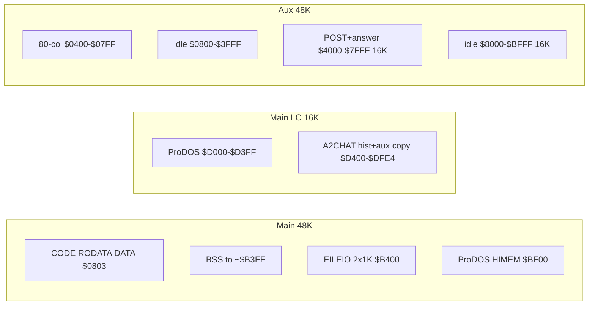
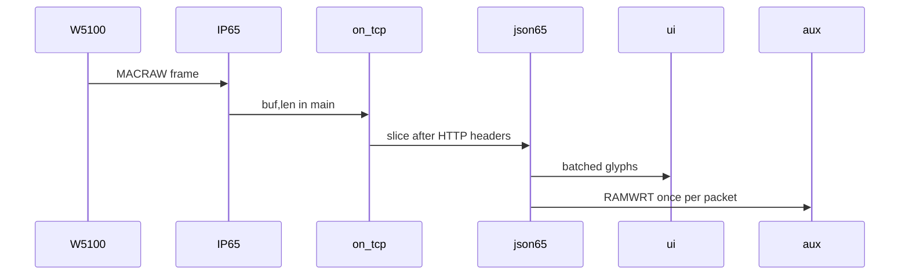

# A2CHAT performance and measurement

Feature work stays frozen. Constraints that must not regress: LC at `$D400` (`$0C00`), no `fread` while TCP is live, IP65 software TCP only, BSS ending below `$B400`.

## Memory as it actually is

128K IIe/IIc is two ~48K banks (`$0000–$BFFF` main and aux) plus language-card 16K (`$D000–$FFFF`, with two 4K banks at `$D000`). A2CHAT already uses:

Bank switching today is **RAMRD/RAMWRT** around every 160-byte bounce (`[src/auxmem.s](a2chat/src/auxmem.s)`, `[src/http65.c](a2chat/src/http65.c)`), not ALTZP. Do **not** use aux language card / `ALTZP`: that swaps zero page and stack and will break IP65 and ProDOS.

Practical extra RAM without new bank types: treat aux `**$4000–$BFFF` as one 32K linear buffer** (hires page 2 + the unused 16K above it). Leave `$0400–$07FF` and ProDOS LC alone.

Inbound **to** the model is `A2CHAT.BOD` on disk, then `fread` → 160-byte `bounce[]` → `aux_write` per chunk, then `aux_read` again in `send_aux`. Inbound **from** the model is worse: `on_tcp` calls C `jsonscan_feed` **per byte**, `fputc` into `A2CHAT.PAY` even though tools are unused, `ui_print_ch` flushes on every space, and `win_add` `memmove`s 39 bytes on every NDJSON seek byte.

## 1) Fewer switches, larger aux, fewer disk hits

- Raise `A2CHAT_AUX_POST_MAX` from `0x4000` to `**0x8000**` (aux `$4000–$BFFF`). Same `aux_write`/`aux_read` offset API; only the cap and the “POST too large” check change.
- Add **bulk** copies in LC: `aux_write`/`aux_read` already copy while RAMWRT/RAMRD is held; the waste is calling them 160 bytes at a time. Stage POST with a **1K bounce in FILEIO unused slack or reuse one ProDOS buffer only while TCP is down**, or copy from the stdio buffer in ≥256-byte chunks. After `fclose(BOD)`, one `send_aux` pass (still no disk during TCP).
- **Do not open `A2CHAT.PAY` on the chat POST** (`[http_post_file](a2chat/src/http65.c)` around the `js->pay = fopen` line). That is a `fputc` per streamed byte for a feature that is off.
- Keep `A2CHAT.LOG` append **after** the TCP close (already true). Optionally enlarge hist `iobuf` from 128 to 256 once BSS allows (bounce shrink freed some BSS; 32K aux is not BSS).
- Longer term (same phase if it still links): stream `hist_write_messages` into aux instead of a BOD file so the only disk before connect is reading `A2CHAT.LOG`. If BSS/LC is too tight, defer BOD elimination; the 32K aux + no PAY file is the win for inbound from the AI.

## 2) Receive-path compute (C first, then 65C02)

Hot path per TCP payload byte:

`on_tcp` → `feed_body` → `jsonscan_on_byte` → `jsonscan_feed` → `on_token` → `emit_ans` → `ui_print_ch` / `aux_write` 32-byte batches.

Order of work (measure after each; see §3):

1. **Packet-oriented C** in `on_tcp`: find `\r\n\r\n` once with a small 4-byte state, then feed the remainder as a slice, not `for` + virtual call per byte.
2. **Fix `win_add`**: 16-byte ring (or rolling last-16) instead of `memmove` 39 bytes/byte. Drop unused `tool_calls` / `"arguments"` / `"name"` scans from the live chat path (keep them behind `#if 0` or host tests only).
3. **Content mode inner loop in 65C02** (new `src/jsonscan.s` or a `.s` next to jsonscan): while `mode == JS_MSG_CONTENT` and the packet has bytes, handle `\\` / `"` / raw char without entering the big C `switch`. Call existing `on_content` only for emit, or write tokens straight to a zp pointer.
4. `**ui_print_ch` during stream**: do not flush on every space; flush at 16 bytes, newline, or packet end. `chat_blit` stays; fewer 80-col aux/main passes.
5. `**ans_buf**`: keep RAMWRT asserted across a full TCP packet when appending the answer to aux (one switch per packet, not per 32 bytes).

Leave IP65 `tcp.s` / `eth_buffer` alone unless profiling shows the callback itself is the limiter (unlikely vs json+stdio+conio).

## 3) Timing and tokens

Preference unchanged: **No-Slot Clock first**, then MegaFlash. Source of truth for MegaFlash is `[docs/MegaFlash-AppleII-API.md](/Users/eositis/Documents/GitHub/MegaFlash/docs/MegaFlash-AppleII-API.md)` (`$C0C0` command port, slot 4). Do **not** treat classic ProDOS `$BF90–$BF93` as the elapsed-time clock.

**Wall clock (when the AI responded)**

- **NSC** (if present): DS1216E, **1 second** BCD. Use for the printed timestamp.
- **MegaFlash RTC** (fallback): Pico RTC, NTP-synced when WiFi is up (`firmware/megaflash.s` `clockdriver` → `CMD_GETPRODOSTIME` `$17` / `CMD_GETPRODOS25TIME` `$18`). Classic ProDOS copies **minute+hour** into `$BF90–$BF93`. ProDOS **2.5+** (`$BFFF >= $25`) also fills `**$BF8E` milliseconds** and `**$BF8F` seconds**. `CMD_GETTIMESTR` `$19` is display-only (`HH:MM AM`, 8 inverse ASCII bytes) — not for deltas.
- Call the patched `$BF06` vector or C0C0 `$17`/`$18` **outside** the per-byte TCP callback (start of POST, first token once, stream done).

**Elapsed time (TTFT and stream duration) — this is the benchmark**

MegaFlash exposes Pico `time_us_32` / `time_us_64` as 32-bit counters (`[pico/cmdhandler.c](/Users/eositis/Documents/GitHub/MegaFlash/pico/cmdhandler.c)` `DoResetTimer_*` / `DoGetTimer_*`):

- `CMD_RESETTIMER_MS` `$42` / `CMD_GETTIMER_MS` `$43` — elapsed **milliseconds** (divide `time_us_64` by 1000). Use this for `t_first` and `t_done`.
- `CMD_GETTIMER_US` `$41` is ~1 µs but the 32-bit value wraps in ~71 minutes; ms is enough for a 3B reply and simpler math on 6502.
- Registers: `cmdreg`/`statusreg` `$C0C0`, `paramreg` `$C0C1` (Uthernet II stays on `$C0C4+`; do not mix). Wait `BUSYFLAG` (bit 7). Read four `paramreg` bytes LSB first.

On a MegaFlash IIc: `RESETTIMER_MS` when the POST send finishes (`t_post = 0`), `GETTIMER_MS` once at first content byte (`t_first`), again after TCP close (`t_done`). Do not issue C0C0 commands inside the per-byte `on_tcp` loop — one shot at first token (flag), one shot after `wait_done`.

If MegaFlash commands fail (IIe without MegaFlash): **NSC seconds** for both stamp and coarse elapsed, else IP65 `timer_read()` (~60 Hz) as last resort.

| Stamp     | When                                                            |
| --------- | --------------------------------------------------------------- |
| `t_post`  | craslast `tcp_send` of the POST succeeded (reset ms timer here) |
| `t_first` | first `message.content` character — “AI responds”               |
| `t_done`  | `"done":true` or TCP close — “AI finished sending”              |

Parse Ollama NDJSON `**eval_count**` (and `prompt_eval_count` if cheap). Report e.g. `12:04:33  8420ms  142 tok  16.9 t/s` using `eval_count / (t_done - t_first)`. Label source `CLOCK=NSC+MFMS|MFMS|NSC|JIFFY`.

Baseline **before** asm: same prompt, `llama3.2:3b`, accelerator on, three runs. Then C-only receive fixes, then 65C02 inner loop.

New files: `[a2chat/src/clock.c](a2chat/src/clock.c)`, `[a2chat/src/nsc.s](a2chat/src/nsc.s)`, `[a2chat/src/mfclock.s](a2chat/src/mfclock.s)` (C0C0 wait + 32-bit param read). Wire stamps in `[ollama.c](a2chat/src/ollama.c)` / `[http65.c](a2chat/src/http65.c)`. Document in `[USERGUIDE.md](a2chat/USERGUIDE.md)`.

## Out of scope

- Moving LC back to `$D000`
- Re-enabling Ollama tools JSON on the POST
- ALTZP / aux LC overlays
- Rewriting IP65 or the W5100 HAL

